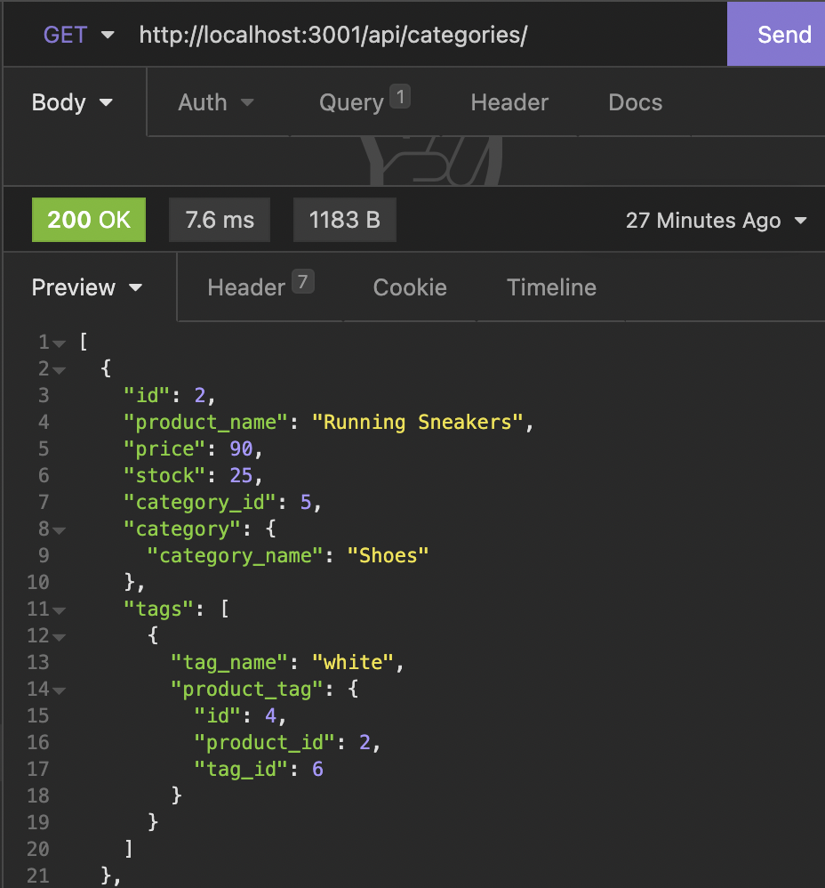

# E-commerce Back-end
  
  
   
  
       
       
   

  ## TABLE OF CONTENTS

  ---

  [Description](#description) *
  [Installation](#installation) *
  [Usage](#usage) *
  [Questions](#questions) 
  
   

  ## Description

  ---

  This is the back-end for an internet retail site.
  
   
  Repo: (https://github.com/sihayah/ecommerce)
  Demo: ...

   

  ## Installation

  ---
  
Run npm i.
  
Then, update .env with your msqyl username and password. 
  
In MySQL (or via a MySQL extension) run schema to create the database. 

Run npm seed Then start server by running npm start.

   

## Usage

  ---

  Open insomnia, and make requests to any of the follwoing locations:

    GET:
        http://localhost:3001/api/categories/
        http://localhost:3001/api/products/
        http://localhost:3001/api/tags/
    POST:
        http://localhost:3001/api/categories/
        http://localhost:3001/api/products/
        http://localhost:3001/api/tags/
    PUT:
        http://localhost:3001/api/categories/{insert any id #}
        http://localhost:3001/api/products/{insert any id #}
        http://localhost:3001/api/tags/{insert any id #}
    DELETE:
        http://localhost:3001/api/categories/{insert any id #}
        http://localhost:3001/api/products/{insert any id #}
        http://localhost:3001/api/tags/{insert any id #}

   
  Expected result for a request getting categories...
   
  
   

  ## Questions

  ---

  For any further inquiries, please contact me via gitHub: [(sihayah)](https://github.com/sihayah) or email: sihaya_a@hotmail.com

   

  

   
   
